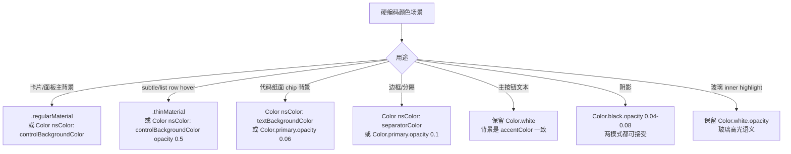

# RelayMac Dark Mode 适配 - 设计文档

## 概述

本次工作让 RelayMac 在 macOS Dark Mode 下获得与 Light Mode 同等的原生外观。设计核心是"**用系统语义色和 Materials 替换硬编码字面量**"，而不是维护两套平行的色板。

### 设计目标

1. **零强制主题**：移除任何 `.environment(\.colorScheme, .light)` / `.preferredColorScheme(.light)` 限制。
2. **语义色优先**：所有硬编码 `Color.white` / `Color(red:...)` 背景替换为 `Material` 或 `Color(nsColor: ...)`。
3. **共享组件集中修复**：新增 3-4 个共享 view modifier，消灭跨文件重复 pattern。
4. **视觉等价**：Light 模式下观感不倒退（现有 Pencil mockup 对齐设计保留）。

---

## 架构

### 颜色替换决策树



### 颜色映射表 (Canonical Replacements)

| 当前硬编码表达式 | 替换方案 | 理由 |
|------------------|----------|------|
| `Color.white`（卡片填充） | `Color(nsColor: .controlBackgroundColor)` 或 `.regularMaterial` | 系统语义色自动适配 |
| `Color.white.opacity(0.92)`（MainWindowView detail card） | `.regularMaterial` | Material 自带 vibrancy，在 dark 下是半透深灰 |
| `Color.white.opacity(0.5)` / `0.28`（subtle fills） | `Color(nsColor: .controlBackgroundColor).opacity(0.6)` 或 `.thinMaterial` | Material 轻量、跟随外观 |
| `Color(red: 0.94, green: 0.94, blue: 0.95)`（chip/separator 背景） | `Color.primary.opacity(0.06)` | primary 反转色，dark 下变暗灰 |
| `Color(red: 0.91, green: 0.91, blue: 0.93)`（stroke 边） | `Color.primary.opacity(0.1)` 或 `Color(nsColor: .separatorColor)` | 语义边框色 |
| `Color.black.opacity(0.04)`（shadow） | 保留（阴影在两模式都 ok），或统一用 `Color.black.opacity(0.08)` 略加强 | 阴影是"黑色"本身没问题 |
| `Color.white`（button primary 文本） | **保留不动** | 背景 `.accentColor`，白字是正确选择 |
| `Color.white.opacity(...)`（GlassAppCard inner stroke highlight, line 80） | **保留不动** | 玻璃高光语义 |
| `Color.primary.opacity(0.05)`（已是语义色） | 保留不动 | 已正确 |
| `Color.green / .orange / .red`（状态指示） | 保留不动 | SwiftUI 自动 dark-tune |

### 新增共享 Modifier（`WorkbenchSurfaces.swift`）

引入两个 view modifier 消灭跨文件重复：

```swift
// 用于 editor/log/data panel 的主面板背景
extension View {
    func workbenchPanelBackground(cornerRadius: CGFloat = 12) -> some View {
        self.background(
            RoundedRectangle(cornerRadius: cornerRadius, style: .continuous)
                .fill(.regularMaterial)
        )
    }
}

// 用于 subtle fill（list row, chip, secondary button）
extension View {
    func workbenchSubtleFill(cornerRadius: CGFloat = 8) -> some View {
        self.background(
            RoundedRectangle(cornerRadius: cornerRadius, style: .continuous)
                .fill(Color.primary.opacity(0.06))
        )
    }
}
```

调用方简化为 `.workbenchPanelBackground()` 替代原来的 `RoundedRectangle.fill(Color.white.opacity(0.5))` + overlay stroke 三行代码。

---

## 组件和接口

### 1. `WorkbenchSurfaces.swift`（关键改造点）

**职责**: 提供整个 RelayMac 的窗口/卡片/面板基础表面。

**变更**:
- `WorkbenchWindowBackground`: 移除 `Color.white` + 硬编码 RGB 渐变。改为透明（让 `NSVisualEffectView` 默认接管）或使用 `Color(nsColor: .windowBackgroundColor)` 作为 base + 可选 subtle material overlay。
- 新增 `workbenchPanelBackground()` 和 `workbenchSubtleFill()` view modifier（上文已列）。
- 保留 `WorkbenchCard` / `WorkbenchOutlinedCard`（已用 material），仅调整 stroke 为 `Color.primary.opacity(0.08)`（已是语义色，确认无硬编码）。

### 2. `SidebarView.swift`

**职责**: 左侧导航栏。

**变更**:
- **删除 `line 87` 的 `.environment(\.colorScheme, .light)`**。
- 其他颜色（status indicator 的 `.green`/`.orange`）保留——已是语义色。

### 3. `MainWindowView.swift`

**职责**: 主窗口容器 + detail card。

**变更**:
- `line 63`: `.fill(Color.white.opacity(0.92))` → `.fill(.regularMaterial)`
- `line 85`: shadow 保留（`Color.black.opacity(0.04)` 在两模式都可接受）
- `line 136`: `action.isPrimary ? Color.white : Color.secondary` — 保留（primary 文本白色是正确的）

### 4. `GlassAppCard.swift`

**职责**: Home 页的 app icon 卡片。

**变更**:
- `line 80` 的 inner stroke `Color.white.opacity(...)` 是玻璃高光语义，**保留**。
- 其他 material + glassEffect 已正确，无需修改。

### 5. `MacLogViewerView.swift`

**职责**: 日志查看器。

**变更**（8-10 处替换）:
- `Color.white.opacity(0.5)` fills → `.workbenchSubtleFill()` modifier 或 `.thinMaterial`
- `Color.white`（line 252）文本纸面 → `Color(nsColor: .textBackgroundColor)`
- `Color(red: 0.94, 0.94, 0.95)` chip 背景 → `Color.primary.opacity(0.06)`
- shadows 保留

### 6. `MacScriptEditorView.swift`

**职责**: 脚本编辑器。

**变更**（10 处替换）:
- `Color.white.opacity(0.5)` 面板 → `.workbenchPanelBackground()` 或 `.thinMaterial`
- `Color.white`（line 210, 217, 294）→ `Color(nsColor: .textBackgroundColor)` 或 `.regularMaterial`
- `Color(red: 0.91, 0.91, 0.93)` strokes → `Color.primary.opacity(0.1)`
- `Color(red: 0.94, 0.94, ...)` 背景 → `Color.primary.opacity(0.06)`
- shadows 保留

### 7. `MacDataViewerView.swift`

**职责**: 数据查看器。

**变更**（9 处替换）:
- `Color.white` / `Color.white.opacity(0.5)` → `.regularMaterial` / `.workbenchSubtleFill()`
- `Color(red: 0.94, ...)` → `Color.primary.opacity(0.06)`
- `Color.accentColor` 保留

### 8. `MacBackupView.swift` + `MacBackupDetailView.swift`

**变更**（~8 处）:
- 同模式：`Color.white` → `.regularMaterial`；subtle → `.workbenchSubtleFill()`
- `Color(red: 0.91, ...)` strokes → `Color.primary.opacity(0.1)`

### 9. `MacPreferencesView.swift`

**变更**（~6 处）:
- `Color.white` / `Color.white.opacity(0.5)` → Material/subtle
- `Color(red: 0.91, ...)` → `Color.primary.opacity(0.1)`
- 状态徽章 `Color.green/.red/.orange.opacity(0.1)` 保留（SwiftUI 自动 tune）

### 10. 其他小文件（`MacAppDetailView` 子组件、`SessionRow`、`SettingRowMac`、`MacSearchView` / `SearchResultRow`、`MacSubscribeListView` / `DetailView`、`MacOnboardingSheet`）

**变更**: 对照 audit report，对每个出现的硬编码 `Color.white/.black/(red:...)` 应用上文映射表。

---

## 数据模型

本次变更不涉及数据模型，仅改动视图层颜色/背景表达式。

---

## 错误处理

| 错误类型 | 处理方式 |
|----------|----------|
| Material 在 macOS 26 pre-release 版本失效 | 使用 `Color(nsColor: .controlBackgroundColor)` fallback |
| 某处替换后 light mode 视觉明显倒退 | 用 Assets.xcassets 添加 Any/Dark color set 作为最后手段 |
| 构建失败（`Color(nsColor:)` 需要 macOS 12+） | RelayMac 已设 macOS 26+，不会触发 |

---

## 测试策略

### 构建验证

| 测试用例 | 描述 |
|----------|------|
| `xcodebuild` RelayMac scheme | 构建通过无 warning |
| grep 残留 `Color.white` | 结果应只剩"预期保留"清单项（按钮 primary 文本、GlassAppCard 玻璃高光、状态指示） |

### 视觉回归（人工）

| 测试用例 | 描述 |
|----------|------|
| Light 模式走查 | 所有主屏幕（Home / AppDetail / Script / Data / Logs / Backup / Subscribe / Search / Preferences / Onboarding）与当前设计 Mockup 一致，不倒退 |
| Dark 模式走查 | 同上屏幕在 dark 下无白色孤岛，文本可读、材质自然 |
| 实时切换 | 系统 Appearance 切换时 RelayMac 立即响应 |

### 预期保留清单（构建后人工 grep 验证）

SC-2 验证残留 `Color.white` 应只在以下场景：
- `MainWindowView.swift:136` — primary button 文本前景
- `GlassAppCard.swift:80` — 玻璃 inner stroke 高光
- (如有) 其他状态指示圆点如 `.fill(Color.green)` 也保留

---

## 风险与权衡

1. **`.regularMaterial` vs `Color(nsColor: .controlBackgroundColor)`**：Material 有 vibrancy 效果更原生，但在某些嵌套场景可能层次不清。默认优先 Material，若视觉检查不满意再回退语义色。
2. **`WorkbenchWindowBackground` 透明化**：如果完全透明导致 NSWindow 默认灰色突兀，保留一层 `Color(nsColor: .windowBackgroundColor)` 作为 base。
3. **共享 modifier 重构范围**：为降低风险，新增 modifier 但**不强制**重构已经工作良好的代码（如 `WorkbenchCard`）；仅用于消灭重复 pattern 的场合。
