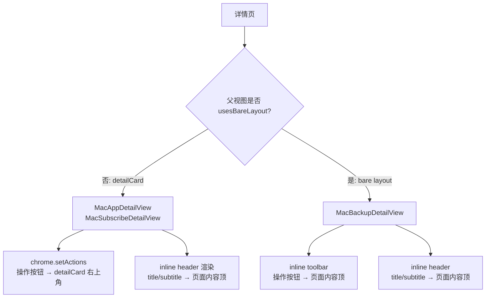

# RelayMac 详情页 Toolbar 修复 - 设计文档

## 概述

替换三个详情页的 `.toolbar`/`.navigationTitle` 原生 API 为 RelayMac 自有的
inline header + WindowChromeModel 方案，避免 hiddenTitleBar 下的渲染偏位。

### 设计目标

1. **统一模式**：非 bare layout 详情页 → chrome.setActions；bare layout
   详情页 → inline toolbar。
2. **视觉等价**：替换后外观与 RelayMac 其他页面 header 一致。
3. **最小改动**：保留所有现有业务逻辑（save/copy/export/revert/delete）；
   只改渲染位置。

---

## 架构

### 路径选择树



### 标题/副标题迁移策略

现有 `.navigationTitle(x)` + `.navigationSubtitle(y)` 替换为页面顶部的
`VStack(alignment: .leading, spacing: 4) { Text(x).font(.largeTitle).bold();
Text(y).font(.subheadline).foregroundStyle(.secondary) }` ——
与 `MacSubscribeListView` / `MacBackupView` 页面 header 风格一致。

---

## 组件和接口

### 1. MacAppDetailView（detailCard 上下文）

**变更**:
- 删除 `.toolbar { ToolbarItem(placement: .primaryAction) { Save } ToolbarItem(placement: .automatic) { Menu } }` 块
- 删除 `.navigationTitle(app.name)` 和 `.navigationSubtitle(app.author.asHandle)`
- 在 `WorkbenchPageScroll` 内容最前加一个 `headerSection` 节（新增私有
  computed property），渲染名称+作者
- 在 `.onAppear` 中调用 `chrome.setActions([...])` 注册 Save 按钮 + "更多"菜单
- 当 `drafts` / `saving` / `currentSession` / `appKeys` 状态变化需要影响按钮
  isDisabled 时：把 setActions 逻辑抽成 `updateChrome()`，通过
  `.onChange(of: drafts)`、`.onChange(of: saving)`、`.onReceive(boxModel.$boxData)`
  触发
- 保留 `⌘S` 快捷键：在 body 最后用 `.background(Button("", action: save)
  .keyboardShortcut("s", modifiers: .command).hidden().disabled(drafts.isEmpty || saving))`

**chrome actions 示例**:
```swift
private func updateChrome() {
    chrome.setActions([
        WindowChromeAction(
            title: saving ? "保存中" : "保存",
            systemImage: "tray.and.arrow.down",
            isPrimary: true,
            isDisabled: drafts.isEmpty || saving,
            kind: .button(action: save)
        ),
        WindowChromeAction(
            title: "更多",
            systemImage: "ellipsis",
            kind: .menu(items: [
                WindowChromeMenuItem(title: "导入会话", ..., action: { showImportSession = true }),
                WindowChromeMenuItem(title: "复制数据", isDisabled: appKeys.isEmpty, action: copyAppDatas),
                WindowChromeMenuItem(title: "复制会话", isDisabled: currentSession == nil, action: { ... }),
                WindowChromeMenuItem(title: "清除数据", role: .destructive, isDisabled: appKeys.isEmpty, action: { showClearConfirm = true })
            ])
        )
    ])
}
```

### 2. MacSubscribeDetailView（detailCard 上下文）

**变更**:
- 删除 `.navigationTitle(sub.name)` 和 `.navigationSubtitle(sub.author.asHandle)`
- 当前 header 扩展，前置 sub.name + sub.author.asHandle
- 保留 `.onAppear { chrome.clear() }`（没有 action 需要注册）
- 无需 chrome.setActions

**新 header 结构**:
```swift
private var header: some View {
    VStack(alignment: .leading, spacing: 8) {
        Text(sub.name).font(.largeTitle).bold()
        Text(sub.author.asHandle).font(.subheadline).foregroundStyle(.secondary)
        Text("共 \(sub.apps.count) 个应用").font(.callout).foregroundStyle(.secondary)
        if !sub.repo.isEmpty {
            Text(sub.repo).font(.footnote).foregroundStyle(.tertiary).textSelection(.enabled)
        }
    }
}
```

### 3. MacBackupDetailView（bare layout 上下文）

**变更**:
- 删除 `.toolbar { toolbar(for: bak) }` 块及辅助函数 `toolbar(for:)`
- 删除 `.navigationTitle(bak?.name ?? "备份详情")`
- 在 content(for:) 的最前新增一个 inline header section：HStack 左边是
  title（bak.name）与备份索引文字，右边是三个按钮（恢复 / 复制 JSON / 导出）
- 三个按钮使用与 MacBackupView 里的 importButton 风格一致的 Image 图标按钮
  （28×28 带 .help 提示）

**新 header 示例**:
```swift
private func inlineHeader(for bak: GlobalBackup) -> some View {
    HStack(alignment: .center, spacing: 12) {
        VStack(alignment: .leading, spacing: 4) {
            Text(bak.name).font(.largeTitle).bold()
            if let t = bak.createTime {
                Text(formatTime(t)).font(.subheadline).foregroundStyle(.secondary)
            }
        }
        Spacer(minLength: 16)
        iconButton("arrow.counterclockwise", tooltip: "恢复", disabled: resolvedBak == nil) {
            showRevertConfirm = true
        }
        iconButton("doc.on.doc", tooltip: "复制 JSON", disabled: resolvedBak == nil, action: copyJSON)
        iconButton("square.and.arrow.up", tooltip: "导出…", disabled: resolvedBak == nil) {
            exportJSON(for: bak)
        }
    }
}
```

---

## 数据模型

本次变更不涉及数据模型，仅视图层渲染位置重排。

---

## 错误处理

| 错误类型 | 处理方式 |
|----------|----------|
| chrome.setActions 在 view 未出现时被调用 | 无副作用；actions 会被后续 onAppear 覆盖 |
| ⌘S 快捷键在 disable 状态被触发 | Button 的 disabled 会阻止 action |
| bak 为 nil 时 inlineHeader 渲染 | 只在 `content(for bak: GlobalBackup)` 分支调用；nil 分支仍走 ContentUnavailableView |

---

## 测试策略

### 构建验证

| 测试用例 | 描述 |
|----------|------|
| `xcodebuild` RelayMac | 构建通过无新增 warning |
| `grep` 三文件中 `\.toolbar\|navigationTitle\|navigationSubtitle` | 结果应为空 |

### 视觉回归（人工）

| 测试用例 | 描述 |
|----------|------|
| Home → App Detail | 保存/更多按钮在 detailCard 右上；标题/副标题在页面内容顶 |
| Subscribe → Subscribe Detail | 标题/副标题在内容顶；右上无按钮（该页无 actions） |
| Subscribe → Subscribe Detail → App Detail | 同 App Detail 行为；返回时正确恢复 |
| Backup → Backup Detail | 标题+按钮 inline 在内容顶 HStack |
| ⌘S 保存 | App Detail 内按 ⌘S 触发保存；drafts 为空时不响应 |

---

## 风险与权衡

1. **keyboardShortcut 的隐藏 Button 方案**：使用 `.hidden()` 的 Button 保留
   ⌘S 快捷键，SwiftUI 会识别快捷键但不显示按钮。有些版本的 SwiftUI 对隐藏
   视图的快捷键响应不稳定。如有问题，fallback：使用 `.background` 嵌入 Button
   + opacity 0。
2. **navigationTitle 丢失 window title**：hiddenTitleBar 下本来就不显示
   titlebar title，所以视觉无影响；但如果将来改成有 titlebar 的 window
   style，需要重新加 navigationTitle。本任务范围不涉及该场景。
3. **chrome updateChrome 触发频率**：`onChange(of: drafts)` 可能在每次输入
   触发 updateChrome；开销是 O(actions.count) 小，可接受。
