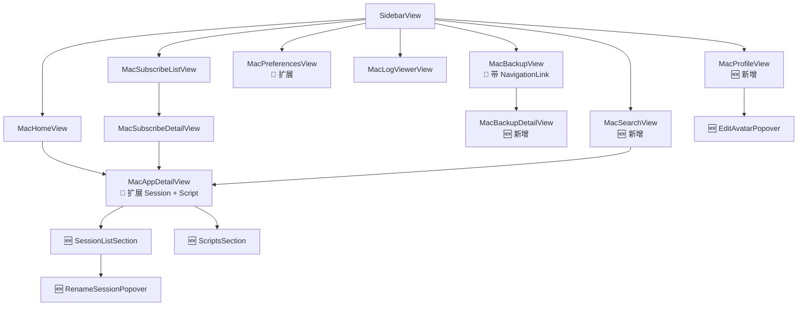

# Relay macOS 功能对齐 - 设计文档

## 概述

在不破坏 iOS target、保持单一共享 ViewModel 的前提下，按 macOS 原生交互习惯新增 5 组功能。

### 设计目标

1. **零 iOS 回归**：共享 ViewModel 不改方法签名，只新增（如需）静态 helper
2. **macOS 原生交互**：contextMenu / swipeActions / Popover / NSAlert / NSOpenPanel / NSSavePanel
3. **视觉一致**：Liquid Glass 材质（`.glassEffect` / `.regularMaterial`），与现有 RelayMac 风格一致
4. **导航不破坏现状**：沿用 `NavigationStack` + `MacRoute` 路由，不重构整体架构

---

## 架构

### 整体架构



### 组件说明

| 组件 | 职责 | 依赖 |
|------|------|------|
| `MacSearchView` (🆕) | 侧栏搜索入口，过滤 `boxData.apps`，点击星标切换收藏 | `BoxJsViewModel`, `MacRoute`, `GlassAppCard`（或 `SearchRow`） |
| `MacProfileView` (🆕) | 头像 / 昵称 / 统计卡片 | `BoxJsViewModel`, `ApiManager`, `AvatarStorage`, `PlatformImage` |
| `EditAvatarPopover` (🆕) | 本地文件 / URL 切换头像 | `NSOpenPanel`, `AvatarStorage`, `BoxJsViewModel.updateDataAsync` |
| `MacBackupDetailView` (🆕) | 备份详情：名称编辑 / Revert / 复制 / 导出 | `BoxJsViewModel`, `NSSavePanel`, `NSAlert` |
| `SessionListSection` (🆕) | 嵌入 `MacAppDetailView`，管理 Session 列表 | `BoxJsViewModel` 会话方法 |
| `ScriptsSection` (🆕) | 嵌入 `MacAppDetailView`，显示 & 运行应用脚本 | `NetworkProvider.runScript` |
| `RenameSessionPopover` (🆕) | Session 重命名浮层 | 本地 State + `updateAppSession` |
| `MacPreferencesView` (🔁) | 扩展「BoxJS 偏好」Section 的 8 个 Toggle | `BoxJsViewModel.updateData` |
| `MacBackupView` (🔁) | 每行包一层 `NavigationLink(value: .backup(id:))` | `MacRoute.backup` 新增 case |
| `MacAppDetailView` (🔁) | 插入 Session / Scripts Section | 同上 |
| `SidebarItem` (🔁) | 新增 `.search`、`.profile` 两枚 | - |
| `MacRoute` (🔁) | 新增 `.backup(id:)` case | - |

---

## 核心决策

### 决策 1：导航路由扩展而非重构

现有 `MacRoute` 只有 `.app(id:)` / `.subscription(url:)`。新增 `.backup(id:)` 让备份详情也走同一 NavigationStack，无需新架构。`MacRouteDestination` 里加 switch case。

### 决策 2：Session 交互方式

**iOS 原版**：tap row → action sheet 菜单；长按 → UI 菜单。
**macOS 本次**：每行 3 种入口（互补非冲突）：
- **右键 contextMenu** → 完整菜单（使用/克隆/重命名/复制 JSON/删除）
- **hover trailing swipeActions** → 高频动作（使用 / 删除，macOS 26 List 原生支持）
- **点击行** → 不做动作（避免误触；若要「使用」就右键或 swipe）

重命名使用 **Popover**（anchor 在行右侧），不用 Sheet（比 iOS 输入更轻量）。

### 决策 3：克隆会话的实现

ViewModel 无现成 `cloneAppSession` 方法。在 `SessionListSection` 内 compose：
```swift
let clone = Session(
    id: UUID().uuidString,
    name: "\(original.name) 副本",
    enable: original.enable,
    appId: original.appId,
    appName: original.appName,
    createTime: ISO8601DateFormatter().string(from: Date()),
    datas: original.datas
)
boxModel.updateAppSession(clone)  // 或调用 saveAppSession-style 插入
```
因为 `updateAppSession` 只更新同 id，这里需要**追加**。方案：在 ViewModel 新增 `cloneAppSession(_:)` 方法（乐观），比直接在 View 里组装 sessions 数组更清晰。

> **ViewModel 最小新增**：在 `Relay/ViewModels/BoxJsViewModel.swift` 追加
> ```swift
> @MainActor
> func cloneAppSession(_ session: Session) {
>     let clone = Session(id: UUID().uuidString, name: "\(session.name) 副本", ...)
>     var all = boxData.sessions
>     all.append(clone)
>     optimistic("克隆会话", apply: { $0.replacingSessions(all) }) {
>         try await ApiRequest.saveSessions(all)
>     }
> }
> ```

### 决策 4：头像存储策略（macOS 沙箱）

`AvatarStorage` 已跨平台（批次 2 已修），沙箱路径使用 `FileManager.default.urls(for: .documentDirectory, ...)`。macOS App Sandbox 的 `.documentDirectory` 指向容器内 `~/Library/Containers/<BundleID>/Data/Documents/`，**完全允许**读写。本地头像文件（PNG）最大不限制（iOS 也没限）。

URL 头像走 `SDWebImageSwiftUI.WebImage`，与现有卡片一致。

### 决策 5：搜索结果 UI

**不复用 GlassAppCard**（卡片式占屏太多）。新增轻量 `SearchResultRow`：
- 左：40×40 图标（WebImage 或 SF Symbol fallback）
- 中：应用名 + id（小号） + 作者（更小号）
- 右：Star 按钮（`star` / `star.fill` + tint）

`List` + `.searchable(text:)` + 每行 `NavigationLink(value: .app(id:))`。

### 决策 6：Preferences 扩展布局

现有 `MacPreferencesView` 已经是 `Form` + 多 Section，直接加一个 Section 即可：
```swift
Section("BoxJS 偏好") {
    Toggle("勿扰模式", isOn: boolBinding(\.isMute))
    Toggle("隐藏帮助", isOn: boolBinding(\.isHideHelp))
    // ... 8 个 Toggle
}
```

通用 binding helper：
```swift
private func boolBinding(_ path: ReferenceWritableKeyPath<UserConfig, Bool?>) -> Binding<Bool> {
    Binding(
        get: { boxModel.boxData.usercfgs?[keyPath: path] ?? false },
        set: { newValue in
            let cfgPath = /* path 对应的 JSON key */
            boxModel.updateData(path: "usercfgs.\(cfgPath)", data: newValue)
        }
    )
}
```

但是因为 `UserConfig` 属性是 `let`（不可写），实际使用需要 `String` key + 手动 mapping。见下文组件接口。

### 决策 7：统计卡片布局

Profile 页顶部一排 3 卡：
```
┌─ 应用 ─┐  ┌─ 订阅 ─┐  ┌─ 会话 ─┐
│  42   │  │   5   │  │  18   │
└───────┘  └───────┘  └───────┘
```

每张卡 `RoundedRectangle` + `.glassEffect(.regular, in: .rect)` + 数字（大字号 `.largeTitle.bold`）+ 标签（`.caption`）。使用 `HStack(spacing: 14)` 展开。

---

## 组件和接口

### 1. SidebarItem (扩展)

```swift
enum SidebarItem: String, Hashable, CaseIterable, Identifiable {
    case home
    case search        // 🆕
    case subscriptions
    case scripts
    case logs
    case backup
    case profile       // 🆕
    case preferences
    case about

    var group: Group {
        switch self {
        case .home, .search, .subscriptions: return .apps
        case .scripts, .logs, .backup: return .tools
        case .profile, .preferences, .about: return .system
        }
    }
}
```

### 2. MacRoute (扩展)

```swift
enum MacRoute: Hashable {
    case app(id: String)
    case subscription(url: String)
    case backup(id: String)    // 🆕
}
```

### 3. MacSearchView (🆕)

```swift
struct MacSearchView: View {
    @EnvironmentObject var boxModel: BoxJsViewModel
    @State private var query: String = ""

    var filtered: [AppModel] {
        guard !query.isEmpty else { return [] }
        let q = query.lowercased()
        return boxModel.boxData.apps.filter {
            $0.name.lowercased().contains(q) || $0.id.lowercased().contains(q)
        }
    }

    var body: some View {
        NavigationStack {
            List { /* ForEach filtered → SearchResultRow */ }
                .searchable(text: $query, prompt: "按名称或 ID 搜索")
                .navigationDestination(for: MacRoute.self) { MacRouteDestination(route: $0) }
        }
    }
}
```

### 4. SearchResultRow (🆕)

```swift
struct SearchResultRow: View {
    let app: AppModel
    let isFavorite: Bool
    let onToggleFavorite: () -> Void
    var body: some View { /* HStack icon + text + star button */ }
}
```

### 5. MacAppDetailView (扩展 Session + Scripts)

```swift
struct MacAppDetailView: View {
    // ... existing state ...
    @State private var renameTarget: Session?   // 🆕

    var body: some View {
        Form {
            Section("基础") { ... }
            if let settings = app.settings, !settings.isEmpty {
                Section("设置") { ... }
            }
            if !sessions.isEmpty {
                SessionListSection(
                    app: app,
                    sessions: sessions,
                    currentSessionId: currentSessionId,
                    onRenameRequested: { renameTarget = $0 }
                )
            }
            if let scripts = app.scripts, !scripts.isEmpty {
                ScriptsSection(scripts: scripts)
            }
        }
        .popover(item: $renameTarget) { session in
            RenameSessionPopover(session: session)
        }
    }

    private var sessions: [Session] {
        boxModel.boxData.sessions.filter { $0.appId == app.id }
    }
    private var currentSessionId: String? {
        boxModel.boxData.curSessions?[app.id]
    }
}
```

### 6. SessionListSection (🆕)

```swift
struct SessionListSection: View {
    let app: AppModel
    let sessions: [Session]
    let currentSessionId: String?
    let onRenameRequested: (Session) -> Void
    @EnvironmentObject var boxModel: BoxJsViewModel

    var body: some View {
        Section {
            ForEach(sessions) { session in
                SessionRow(
                    session: session,
                    isActive: session.id == currentSessionId
                )
                .contextMenu { contextMenu(for: session) }
                .swipeActions(edge: .trailing) { swipeActions(for: session) }
            }
        } header: {
            HStack {
                Text("会话")
                Spacer()
                Button { createEmpty() } label: { Label("新建", systemImage: "plus") }
                    .buttonStyle(.borderless)
            }
        }
    }
    // ... contextMenu / swipeActions / createEmpty / clone / delete logic
}
```

### 7. ScriptsSection (🆕)

```swift
struct ScriptsSection: View {
    let scripts: [RunScript]
    @EnvironmentObject var toastManager: ToastManager
    @State private var runningIndex: Int?

    var body: some View {
        Section("脚本") {
            ForEach(scripts.indices, id: \.self) { i in
                HStack {
                    Text("\(i + 1). \(scripts[i].name)")
                    Spacer()
                    Button { run(scripts[i], index: i) } label: {
                        if runningIndex == i {
                            ProgressView().controlSize(.small)
                        } else {
                            Label("运行", systemImage: "play.circle")
                        }
                    }
                    .disabled(runningIndex != nil)
                }
            }
        }
    }

    private func run(_ script: RunScript, index: Int) {
        runningIndex = index
        Task { @MainActor in
            do {
                let _: EmptyResp = try await NetworkProvider.request(.runScript(url: script.script))
                toastManager.showToast(message: "\(script.name) 执行完成")
            } catch {
                toastManager.showToast(message: "运行失败：\(error.localizedDescription)")
            }
            runningIndex = nil
        }
    }
}
```

### 8. MacBackupDetailView (🆕)

```swift
struct MacBackupDetailView: View {
    let bakId: String
    @EnvironmentObject var boxModel: BoxJsViewModel
    @EnvironmentObject var toastManager: ToastManager
    @Environment(\.dismiss) private var dismiss

    @State private var nameDraft: String = ""
    @State private var showRevertConfirm = false

    private var bak: GlobalBackup? {
        boxModel.boxData.globalbaks?.first(where: { $0.id == bakId })
    }

    var body: some View {
        // Form with hero + TextField + JSON preview + toolbar actions
    }
}
```

### 9. MacProfileView (🆕)

```swift
struct MacProfileView: View {
    @EnvironmentObject var boxModel: BoxJsViewModel
    @EnvironmentObject var apiManager: ApiManager
    @EnvironmentObject var toastManager: ToastManager

    @State private var showAvatarEditor = false
    @State private var nameDraft: String = ""

    var body: some View {
        Form {
            // Avatar Section with edit button
            // Name Section with inline TextField
            // Stats Section with 3 glass cards
        }
    }
}
```

### 10. BoxJsViewModel 新增方法

**唯一的 ViewModel 改动**（shared layer）：

```swift
// Relay/ViewModels/BoxJsViewModel.swift
@MainActor
func cloneAppSession(_ session: Session) {
    let clone = Session(
        id: UUID().uuidString,
        name: "\(session.name) 副本",
        enable: session.enable,
        appId: session.appId,
        appName: session.appName,
        createTime: ISO8601DateFormatter().string(from: Date()),
        datas: session.datas
    )
    var all = boxData.sessions
    all.append(clone)
    let sessions = all
    optimistic("克隆会话", apply: { $0.replacingSessions(sessions) }) {
        try await ApiRequest.saveSessions(sessions)
    }
}
```

iOS 端暂不使用此方法，但方法可用；iOS target 构建不受影响（只是多一个未调用的 public 方法）。

---

## 数据模型

不新增 model。复用现有：
- `Session` — 会话
- `AppModel` — 应用
- `RunScript` — 脚本
- `GlobalBackup` — 备份
- `UserConfig` — 偏好（usercfgs）

---

## 错误处理

| 场景 | 处理 |
|------|------|
| Session 操作失败 | ViewModel 的 `optimistic` 已处理 → Toast 错误 |
| 脚本运行失败 | Section 内 catch → Toast |
| 备份 Revert 失败 | NSAlert 确认前检查；失败 → Toast，不 dismiss |
| 头像本地保存失败 | Toast + 不更新头像显示 |
| 偏好 Toggle 网络失败 | ViewModel 已有 optimistic 回滚 |

---

## 测试策略

无 XCTest target。人工冒烟清单：

| 步骤 | 期望 |
|------|------|
| 侧栏多出「搜索」和「个人资料」条目 | ✅ |
| 搜索输入关键词 → 过滤应用 + 星标切换 | ✅ |
| 应用详情显示会话区 → 右键任一会话 → 菜单出现 | ✅ |
| 使用 / 克隆 / 删除 / 重命名分别可工作 | ✅ |
| 应用脚本运行按钮 → loading → Toast | ✅ |
| 备份列表点击 → 详情页 → Revert 确认 | ✅ |
| Profile 改昵称 + 切换本地头像 | ✅ |
| Preferences 切换 8 个 Toggle 均保存 | ✅ |
| RelayMac 构建零错误 | ✅ |
| Relay iOS 构建零错误（回归） | ✅ |

---

## 风险与缓解

| 风险 | 影响 | 缓解 |
|------|------|------|
| Popover 在 Form 内不响应 | 中 | 预案：改用 Sheet（尺寸 380×180） |
| SwipeActions 在 Form 内失效 | 中 | Form 内不可靠 → 回退到纯 contextMenu |
| macOS 26 `.glassEffect` Beta 行为变化 | 低 | 用 `.regularMaterial` 备用 |
| NavigationStack 内嵌 Form 布局卡顿 | 低 | 观察 + 按需用 ScrollView 替代 |
| usercfgs Toggle 字段为 nil 导致默认 false 与服务器不一致 | 中 | 首次保存时写完整字段 |

---

## 不在范围内

- 收藏 / 订阅源 CRUD（排序/增删）
- 静态页面（版本 / 致谢 / 免责 / BoxJS 引导）
- 数据查看器（Data Viewer）
- HTML 描述渲染
- 会话导入 JSON（iOS 有，但 macOS 延后）
